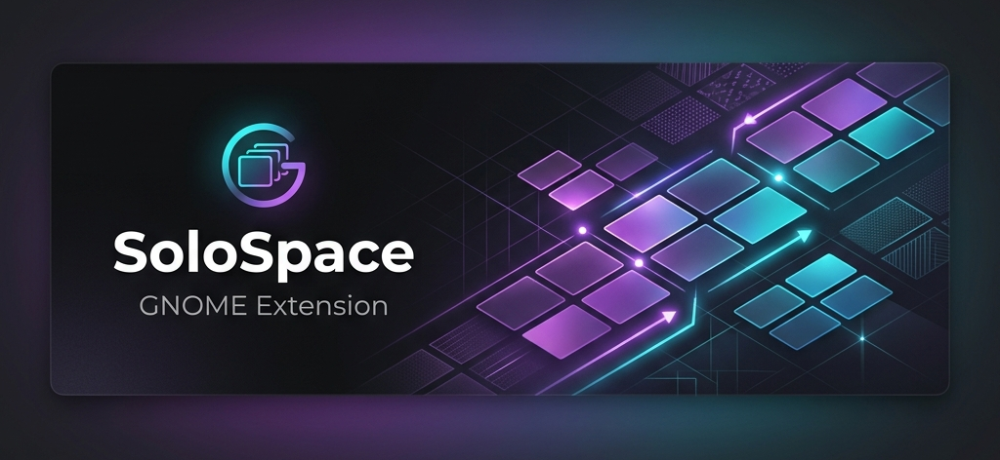
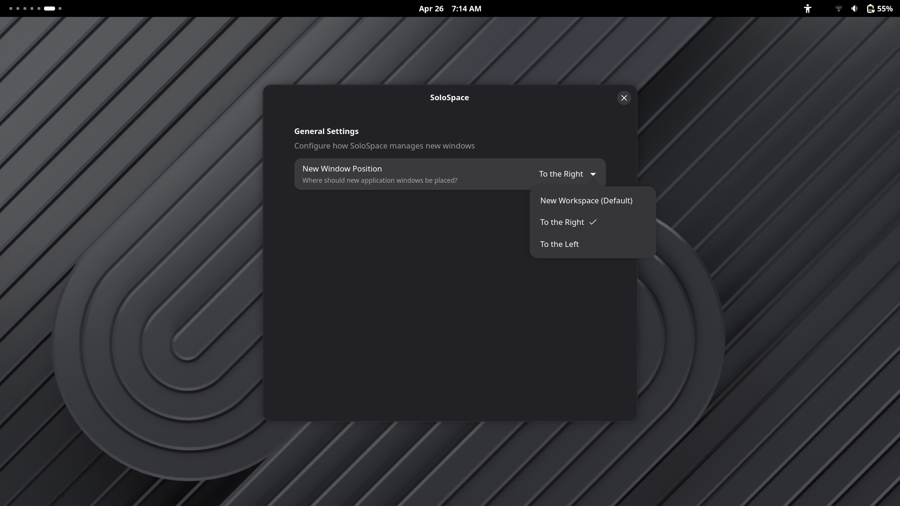

# Solo Space



Solo Space is a premium GNOME Shell extension designed for ultimate focus. It automatically manages your workspaces by ensuring every new application window opens in its own dedicated space, providing a seamless single-tasking environment reminiscent of macOS full-screen apps.

## ✨ Features

- 🎯 **Automatic Isolation**: Every new window is intelligently moved to an empty workspace.
- 🚀 **Dynamic Management**: Creates new workspaces on-the-fly as needed.
- ⚡ **Instant Activation**: Automatically switches focus to the new workspace so you can start working immediately.
- 🛠 **Customizable Placement**: Choose whether new windows open in a brand new workspace or adjacent to your current one.
- 🎨 **GNOME Native**: Built with Adwaita and GSettings for a perfectly integrated experience.

## 📸 Screenshots

### Customization at your fingertips

*Fine-tune how Solo Space handles your windows through the extension settings.*

## 🚀 Installation

### Quick Install (Recommended)

The easiest way to install Solo Space is via the included installation script:

1. Clone the repository:
   ```bash
   git clone https://github.com/DenHafiz69/solospace.git
   cd solospace
   ```

2. Run the installation script:
   ```bash
   chmod +x install.sh
   ./install.sh
   ```

3. **Restart GNOME Shell**:
   - **Wayland**: Log out and log back in.
   - **X11**: Press `Alt+F2`, type `r`, and press `Enter`.

### Manual Installation

If you prefer to install manually:

1. Create the extension directory:
   ```bash
   mkdir -p ~/.local/share/gnome-shell/extensions/solospace@denhafiz.github.com
   ```

2. Copy the extension files:
   ```bash
   cp extension.js metadata.json prefs.js -r schemas ~/.local/share/gnome-shell/extensions/solospace@denhafiz.github.com/
   ```

3. Compile the schemas:
   ```bash
   glib-compile-schemas ~/.local/share/gnome-shell/extensions/solospace@denhafiz.github.com/schemas/
   ```

4. Enable the extension:
   ```bash
   gnome-extensions enable solospace@denhafiz.github.com
   ```

## 🛠 Compatibility

Solo Space is compatible with modern GNOME Shell versions:

| GNOME Version | Status |
| :--- | :--- |
| **GNOME 45** | ✅ Supported |
| **GNOME 46** | ✅ Supported |
| **GNOME 47** | ✅ Supported |
| **GNOME 50** | ✅ Supported |

## 🤝 Contributing

Contributions are welcome! Feel free to open issues or submit pull requests to improve Solo Space.

## 📄 License

This project is licensed under the MIT License - see the [LICENSE](LICENSE) file for details.
